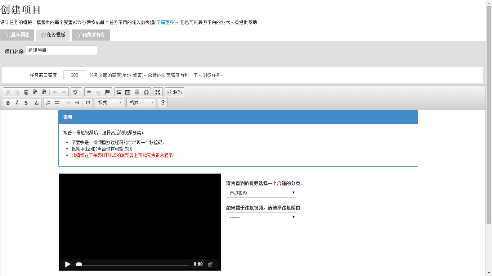

## 基本流程

* 用户在前台创建项目（设计任务模板,设置过滤条件、酬金、超时时间等）

* 用户可以调用工具或者编写程序调用接口向已创建好的项目中批量导入任务

* 众智云合将任务分发给工人进行处理 ( 排队调度, 变量替换, 结果反馈 )

* 在整个处理过程中，用户可以调用接口监控项目的整体执行情况

------
## 常规项目

在发布任务前，用户需要创建一个项目，用来描述任务的基本信息、任务内容等

任务的基本信息包括标题、任务说明、关键字、酬金等

任务内容是以HTML格式组织的网页模板，通过替换模板中的变量显示完整的任务内容

>在不引起混淆的情况下，常规项目简称为项目（与训练项目区别）

------

## 常规任务

用户需要工人进行回答（处理）的问题，包括问题内容和需要回答的输入项

在常规项目创建后，用户可以用CVS文件批量导入常规任务

常规任务被分配后，以网页的形式展现给工人，工人浏览任务的内容、输入答案作为任务的结果

>在不引起混淆的情况下，常规任务简称为任务（与训练任务区别）

------

## 任务模板

用来表达任务内容的页面模板。在创建项目时，用户可以设计不同的模板来表达各式各样的任务内容

任务模板中包含了变量、输入项。例如一个图片分类项目，它的任务模板可能包含了一个图片地址的变量，以及一个分类结果的输入项

在发布任务时，用户上传实际的图片地址，任务模板经过变量替换之后即可生成一个完整的任务页面

工人得到任务页面后，完成输入项的输入后，将结果提交至后台。用户再通过接口获取图片的分类结果

>在任务模板中可以加入js脚本，实现一些简单业务逻辑，甚至复杂的跨域查询

------

## 过滤条件

用户可以在创建项目时设置过滤条件，筛选符合条件的工人来完成项目的任务

目前CrowdTask提供了针对工人熟练度、性别、年龄、地区、婚姻状况的过滤条件

>**注意**: 如果任务内容可能涉及成人内容，请在创建项目时标记，CrowdTask会自动增加年龄大于18岁的过滤条件

## 酬金

工人在执行常规任务后，用户需要支付给工人的酬劳

酬金是决定工人是否愿意接取任务的最重要的条件，用户需要根据任务的难度、耗时合理设置酬金

过低的酬金会导致用户的任务无人应答

##用户信誉度

用户可以利用过滤条件筛选工人，工人也能根据用户信誉度选择是否接取该用户的任务

>用户信誉度 = (已支付酬金的任务数量/发布的任务总数)*100%

用户发布的常规任务数量越多、支付酬金越积极（不恶意拒绝工人提交的任务结果），用户的信誉度越高

用户信誉度也是影响工人接取任务的重要条件

- - -

